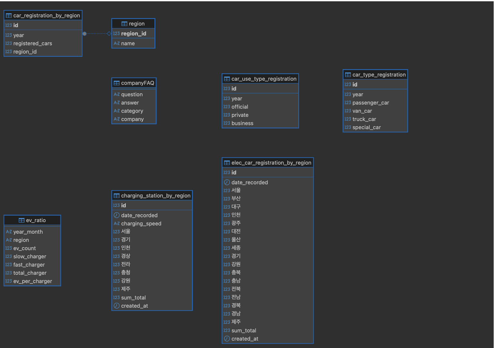
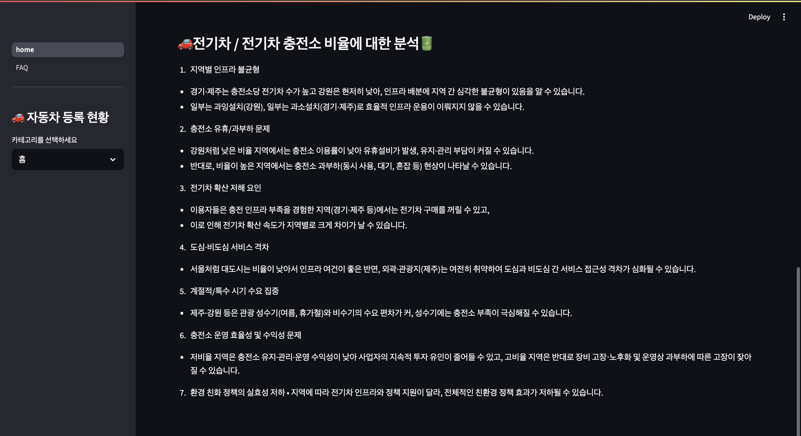

# 🚗 자동차 등록 현황 분석 대시보드 발표자료

## 1. 개요
전국 자동차 등록 현황 및 기업 FAQ 조회시스템 및  
전기자동차 분야 분석
---

## 2. 데이터베이스 ERD 구조

- 주요 테이블: `car_registration_by_region`, `elec_car_registration_by_region`, `charging_station_by_region`, `car_type_registration`, `car_use_type_registration`, `companyFAQ`, `ev_ratio`
- 시도별, 차종별, 용도별, 전기차/충전소 통계 정보를 바탕으로 다양한 분석이 가능함

---

## 3. 요약 대시보드

- 전체 차량 수: **5,262만 대**
- 전기차 수: **754,106 대**
- 충전소 수: **394,132 기**
- 전기차 1대당 충전소 수: **0.52 대/기**
- 전기차 비중 약 **1.4%**, 전년 대비 **+2.9% 증가**

---

## 4. 인사이트 정리 페이지

### 전기차/충전소 비율 분석 요약
1. **지역별 인프라 불균형** – 경기·제주는 충전소당 전기차 비율 높고, 강원 등은 낮음  
2. **충전소 유휴/과부하 문제**  
3. **전기차 확산 저해 요인** – 인프라 부족, 서비스 격차  
4. **도심/비도심 격차 및 계절적 요인**  
5. **충전소 운영 효율성 문제**  
6. **환경정책 실효성 차이**

---

## 5. 메인 대시보드 기능

- 📄 자동차 관련 최신 뉴스 크롤링 기능
- ☀️ 오늘의 날씨 정보 (지역별 실시간)
- 🔍 기사 검색 및 정렬 기능

---

## 6. 시도별 등록 차량 추이

- 시작 연도: 2000년 / 종료 연도: 2024년
- 지역별 차량 등록 대수 변화 추이 시각화
- 총 등록 차량 수: **96,836만대**
- 연도별 평균 등록 수: **3,873만대**
- 최대 등록 연도: **2024년 (665만대)**

---

## 7. 연도별 전체 등록 차량 총합

- 전체 연도(2000~2024) 동안 등록된 차량 수의 증가 추세를 확인할 수 있음
- 꾸준한 성장세를 보이며 **2024년까지 약 5000만대 이상 등록**

---

## 8. 차종별 등록 현황

- 승용차, 승합차, 화물차, 특수차로 분류
- 승용차가 가장 많은 비율을 차지
- 총 등록 수: **94,447만대**
- 최대 등록 연도: **2024년 (2,630만대)**

---

## 9. 용도별 등록 현황

- 공용/자가용/영업용으로 구분된 등록 추이
- 자가용 비중이 압도적으로 높음
- 총 등록 수: **94,443만대**
- 최대 등록 연도: **2024년 (2,630만대)**

---

## 10. 전기차 등록 추이

- 2017년부터 2024년까지 연도별 등록 변화
- 2024년 전기차 등록 수가 큰 폭으로 증가 (600만대 수준 추정)

---

## 11. 충전소 구축 추이

- 완속, 급속 충전소 구분
- 2023~2024년 급속 증가세

---

## 12. 지역별 전기차/충전소 비율 분석

- 최신 기준: 제주, 경기 지역의 충전소 대비 전기차 대수 비율이 높음
- 수도권 외곽은 비율이 낮은 편

---

## 13. 연도별 지역 충전소 비율 변화 (%)

- 인천, 서울의 비율 상승
- 제주 지역의 충전소 비율은 점차 하락

---

## 14. 브랜드 FAQ 예시 – INFINITI

- 브랜드 별 자주 묻는 질문(FAQ)을 제공
- INFINITI 관련 이미지, 서비스/보증/리콜 정보 제공

---

## 15. 상세 카테고리 FAQ

- 고객 질문에 대한 공식 응답 제공
- 예시: 인피니티 서비스 종료 일정은 2028년까지 유지 예정

---

## ✅ 마무리

- 본 대시보드는 사용자에게 시각적인 인사이트를 제공하며, 정책 및 마케팅 전략 수립에 유용한 자료로 활용 가능
- 데이터의 지속적 업데이트를 통해 신뢰성 확보 필요
